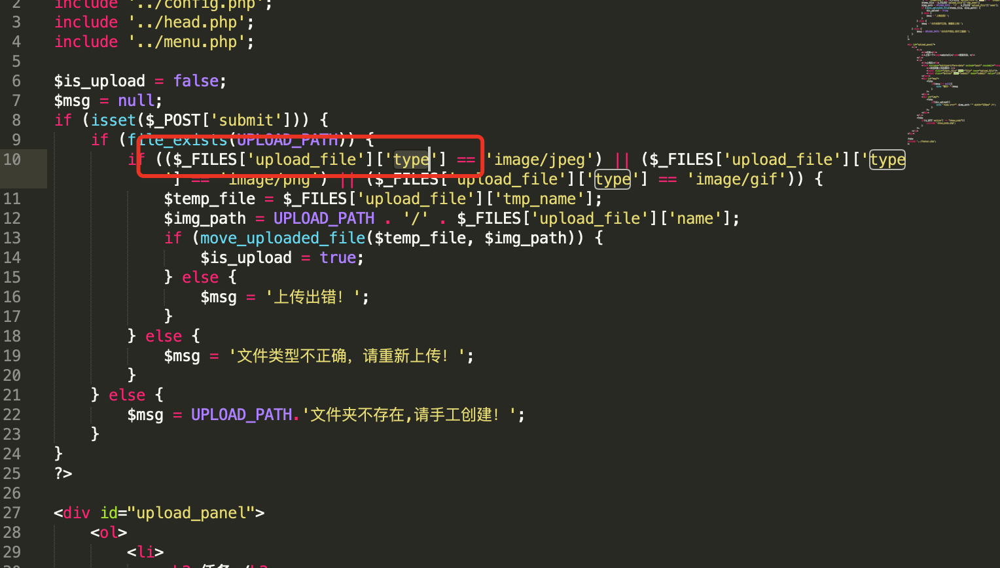
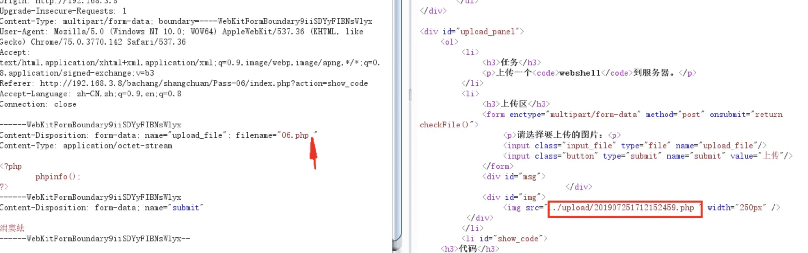

# upload-labs

## lab1

这个是前端的限制


我们可以先把index.php修改为index.png，然后抓包拦截修改为php就可以了。


## lab2

跟lab1一样的方法也可以绕过，但是这个是php后端的限制：




可以看到他们只对content-type进行了检查，所以按照第一次，我们首先上传一个png图片然后改为php的话刚好也可以绕过。


## lab3

发现是黑名单判断，于是尝试用php3,phtml,php5绕过，绕过确实是可以的，但是我的lab源码里面存在改文件名的行为,emmmm但是wp里面没有，哭泣。


## lab4


这里几乎禁用了所有的上传名绕过方式

~~~php
$deny_ext = array(".php",".php5",".php4",".php3",".php2",".php1",".html",".htm",".phtml",".pht",".pHp",".pHp5",".pHp4",".pHp3",".pHp2",".pHp1",".Html",".Htm",".pHtml",".jsp",".jspa",".jspx",".jsw",".jsv",".jspf",".jtml",".jSp",".jSpx",".jSpa",".jSw",".jSv",".jSpf",".jHtml",".asp",".aspx",".asa",".asax",".ascx",".ashx",".asmx",".cer",".aSp",".aSpx",".aSa",".aSax",".aScx",".aShx",".aSmx",".cEr",".sWf",".swf",".ini");
~~~

但是我们发现他没有禁止.htaccess文件，。

### 首先.htaccess什么?

.htaccess是一个纯文本文件，它里面存放着Apache服务器配置相关的指令。

当我们使用apache部署一个网站代码准备部署到网上的时候，我们手中的apache的httpd.conf大家肯定都知道。这是apache的配置文件，然而我们大多数的网站都是基于云服务器来部署的，还有就是团队协作开发的时候，我们很难直接修改公共的httpd.conf，这时 .htaccess就是httpd.conf的衍生品，它起着和httpd.conf相同的作用。

### .htaccess的基本作用

- URL重写、自定义错误页面
- MIME类型配置
- 访问权限控制等
- 主要体现在伪静态的应用
- 图片防盗链
- 自定义404错误页面
- 阻止/允许特定IP/IP段
- 目录浏览与主页
- 禁止访问指定文件类型
- 文件密码保护

> 具体看跟目录下的html

在这个题目里面，我们可以上传一个.htaceess文件来帮助解决限制：

```
SetHandler application/x-httpd-php
```

这样所有的文件都会被解析成为php文件


## lab5

这个题目相比于lab4实际上是再次禁止了.htaccess文件的上传。

但是他修改了原来的大小写上传限制。

~~~php
 $file_ext = strtolower($file_ext); //转换为小写
~~~


## lab6

这个少了空格限制

~~~php
$file_ext = trim($file_ext); //首尾去空
~~~

所以我们可以用添加空格的方式进行绕过。



## lab7

这个是少了.的限制。

~~~php
$file_name = deldot($file_name);//删除文件名末尾的点
~~~

所以我们可以后缀名加点的形式进行绕过。


## lab8

~~~php
 $file_ext = str_ireplace('::$DATA', '', $file_ext);//去除字符串::$DATA
~~~

这次没有了::$DATA的限制。


